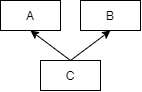
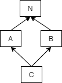

### 结构体
#### 结构体sizeof大小
```c++
struct A
    {
        char a;
        int b;
        char c;
    } a = {'a', 10, 'o'};

struct A
    {
        char a;
        char c;
        int b;
    } a = {'a', 'o', 10};
```
两种方式下占用内存大小不同(原因：编译器对程序的优化-内存对齐)
#### 结构体嵌套：
```c++
struct Date
{
    unsigned int year;
    unsigned int month;
    unsigned int day;
};

struct Info
{
    unsigned long identifier;//学号，用无符号长整数表示
    char name[20];//名字，用字符数组表示
    struct Date date;/*---入学日期，用结构体Date表示---*/
    unsigned int years;//学制，用无符号整数表示
};
```

#### 结构体数组
结构体数组定义：
```c++
struct 结构体类型
{
    成员;
} 数组名[长度];

/****或者这样****/

struct 结构体类型
{
    成员;
};
struct 结构体类型 数组名[长度];
```
#### 结构体指针
```
struct Info *pinfo;
```
但是在指针这里，结构体和数组就不一样了。我们知道，数组名实际上就是指向这个数组第一个元素的地址，所以可以将数组名直接赋值给指针。而结构体的变量名并不是指向该结构体的地址，所以要使用取地址运算符&才能获取地址：
```c++
pinfo = &info;
```
通过指针访问结构体
```c++
(*结构体指针).成员名
结构体指针-> 成员名
```

#### 动态申请结构体
```c++
int main(void)
{
    struct Info *i1;
    struct Info *i2;
    
    i1 = (struct Info *)malloc(sizeof(struct Info));
    i2 = (struct Info *)malloc(sizeof(struct Info));
    if (i1 == NULL || i2 == NULL)
    {
        printf("内存分配失败！\n");
        exit(1);
    }
    return 0;
}
```

#### 内存池

#### 共用体


参考[^C语言之结构体就这样被攻克了]:
[^C语言之结构体就这样被攻克了]:[C语言之结构体就这样被攻克了]( https://mp.weixin.qq.com/s/IebV8FebTLrTbPuT8eva6Q)


### STL与排序算法


```c++
bool m_sort(pair<int,int>& A, pair<int,int> & B){
    return (A.first * B.second)< (A.second * B.first);
}
class Solution {
public:

    vector<int> kthSmallestPrimeFraction(vector<int>& arr, int k) {
        if(arr.size()==2){
            return arr;
        }
        vector<pair<int,int>> m_vec;
        for(int i = 0 ; i < arr.size() ; i++){
            for(int j = i+1 ; j < arr.size(); j++){
                m_vec.push_back({arr[i], arr[j]});
            }
        }
        sort(m_vec.begin(),m_vec.end(),m_sort);

        return {m_vec[k-1].first, m_vec[k-1].second};


    }
};

```

#### vector
```c++
迭代器：
vector<int>nums(N,0); // 
vector<int>::iterator it = nums.begin();// 迭代器begin()指向第一个元素，end()指向最后一个元素的下一个位置。
find(nums.begin(),nums.end(), find_val) == nums.end();// not found

```


#### string

```cpp
string s
string s = "abcsdd" ;
string str = s.substr(3, 2);
if(s.find(str) == s.npos){
	cout << "not found" << endl;
}else{
	cout << "found " << s.find(str) << endl;
} 

```


### C++指针
优先级问题：` * () []`
数组名后面的 `[]` 和 函数名后面的`()` 具有相同的优先级， 均高于` *` 指针运算符
`[]` 和 `()` 优先级相同时， 从左向右结合


#### 一维数组
```c++
int data[8];
int *data[8];
int (*data)[8];
```
#### 二维数组
```c++
int data[3][4];
int (*data)[3][4];
int * data[3][4];
int (*data)[3][4];
int (*data[3])[4];
```
#### 函数与指针
```c++
char * func(char* ptr); // 函数声明
char* (*pt)(char* ptr); // pt 为函数指针
char* func(char* ptr) //函数原型
{
    return NULL;
}
```
#### Question?

```c++
一维数组数组名与一级指针
    int dta[3] = {1,2,3};
    int *q = data; // ok

二维数组数组名与二级指针
    int data [2][3] = {1,2,3,4,5,6};
    int **pt = data; // error
```

参考[^1]：
[^1]:[参考](https://blog.csdn.net/weixin_30537451/article/details/98315609)


### c关键字详解
#### 1. typedef

```c++
int (*ptr) [5]; // 一个数组指针，指向一个5元素的数组
typedef int(*PTR_TO_ARRAY)[3];
PTR_TO_ARRAY a = &array;
```
程序：
```c++
// 定义一个类型 这种类型是指针类型，指针指向数组，数组中三个int元素
typedef int(*ptr_array_three)[3]; 


int main()
{
    int (*ptr_three)[3];
    int arry[] = {1,2,3};
    printf("   arry = %d,\n",arry);
    printf("  &arry = %d,\n",&arry);
    printf("&arry[0]= %d,\n",&arry[0]);

    ptr_array_three a = ptr_three;
   //  a = arry; error
    a = &arry;
    
    cout << typeid(a).name() << endl;
    // typeid(a).name() = PA3_i
    cout << typeid(arry).name() << endl;
    // typeid(arry).name() = A3_i
    cout << typeid(&arry).name() << endl;
    // typeid(&arry).name() = PA3_i  类型： int (*)[]

    return 0;

}
```
typeid(&arry).name()参考[^C++一维数组名和数组名取地址]
[^C++一维数组名和数组名取地址]:[C++一维数组名和数组名取地址](https://blog.csdn.net/qq_44848423/article/details/103490043)

#### 2. #indef
```C++
#ifndef __M_STRING__
#define __M_STRING__

#include<stdio.h>
#include<stdlib.h>
int func(void);


#endif
```

#### 3.static
static 

代码如下：
```c++
#include<stdio.h>
#include<stdlib.h>
#include<iostream>
#include<string>
#include<math.h>
#include<vector>
#include<map>
#include<algorithm>

using namespace std;

class A{
public:
    A(){}
    ~A(){}
    void eat(){}
    void drink(){}
    void play(){}
    void happy(){}
public:
    char data[32];
    static int number ; // 声明静态成员变量但没有定义 
};

int A::number = 0 ; // 定义 并 初始化
int main()
{
    A a;
    int len  = sizeof(a);
    len = sizeof(A);
    cout << A::number << endl;
    A::number = 2;
    cout << A::number << endl;
    cout << "len= " << len << endl;

    return 0;
    
}
```

### C++类
#### 封装

`封装`

public: private: protected:


+ 成员变量
  + 普通成员变量
  + const 常量
  + static 变量


+ 成员函数

  + 默认构造函数

  + 拷贝构造函数
  + 析构函数
#### 继承
`继承`

`父类(基类),子类(派生类)`

虚函数原因：

当子类继承父类时，子类可以遮蔽父类的同名函数。

父类指针指向子类对象中的函数时，会调用父类中的函数。要想实现调用子类中函数，需要将父类中的同名函数定义为虚函数。`virtual void fun(){}`


多继承：



```c++
#include<stdio.h>
#include<stdlib.h>
#include<iostream>
using namespace std;

class A{
public:
    A():m_data(1),m_a(1)
    {

    }
    ~A(){}

public:
    int m_data;
    int m_a;
};

class B{
public:
    B():m_data(1),m_b(1){

    }   
    ~B(){} 

public: 
    int m_data;
    int m_b;
};

class C :public A, public B{

};

int main()
{
    C Data;
   // Data.m_data = 10; // 错误，指向不明确
   // 通过 域成员运算符才可以访问使用不方面。
    Data.A::m_data = 10;
    Data.B::m_data = 2;
    std::cout << Data.A::m_data << " " << Data.B::m_data << endl;
    return 0;

}
```


菱形继承




这种继承方式也存在数据的二义性，这里的二义性是由于他们间接都有相同的基类导致的。 这种菱形继承除了带来二义性之外，还会浪费内存空间


```c++
#include<stdio.h>
#include<stdlib.h>
#include<iostream>
using namespace std;

//  公共基类
class N{
public:
    N(int data1, int data2, int data3):m_data1(data1),m_data2(data2),m_data3(data3)
    {
        cout << "cal common constrctor " << endl;
    }
    virtual ~N()
    {

    }
    void display()
    {
        cout << m_data1 << endl;
    }

public:
    int m_data1;
    int m_data2;
    int m_data3;
};

class A : public N
{
public: 
    A():N(11,12,13),m_a(1)
    {
        cout << "cal A constrctor " << endl;

    }
    ~A(){}
public: 
    int m_a;
};

class B : public N
{
public: 
    B():N(21,22,23),m_b(2)
    {
        cout << "cal B constrctor " << endl;

    }
    ~B(){}
public: 
    int m_b;
};

class C: public B ,public A // C 的构造顺序与 此行的继承顺序相同。
{
public:
    C():A(),B(),m_c(3)
    {
        cout << "cal C constrctor " << endl;

    }
    void show()
    {
        cout << "m_c= " << m_c << endl;
    }

public:
    int m_c;


};

int main()
{
    C c1;
    c1.show();
    cout << "**" << endl;
    return 0;
}
```


```
多继承：
菱形继承：
```


#### 多态
`多态`


满足一下三个条件：
1.父类指针指向子类对象
2.子类中对父类的函数进行重新
3.父类中的同名函数为虚函数


解释：
通过父类指针指向子类对象，在程序运行时才能找到动态绑定到父类指针上的对象，而后系统内部要查类的“虚函数表”，然后找到函数的入口地址，从而调用父类或者子类的函数。


+ 纯虚函数

`纯虚函数`是父类中声明的虚函数，在父类中没有函数体，要求子类定义该函数自己的实现方法。

含有纯虚函数的类叫做`抽象类`

```cpp
class father{
public:
    virtual void eat() = 0;// 这是一个纯虚函数
};
```

+ 虚函数表

如果一个类中含有虚函数，编译器就会为该类产生一个虚函数表，虚函数里存放这个类各个函数的入口地址(指针)。


继承关系分析[^继承]：
[^继承]:[C++菱形继承问题和虚继承分析_Keep Moving~-CSDN博客_c++菱形继承](https://blog.csdn.net/c_base_jin/article/details/86036185)


#### 类内存模型
参考[^2]：
参考[^3]：

[^2]:[C++中关于内存的总结](https://www.cnblogs.com/hkkeryu/p/15350469.html)             
[^3]:[类（继承）的内存分配详解](https://blog.csdn.net/vainlyhopelim/article/details/47754095) 


#### 构造函数析构函数


### C++11用法

