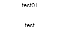
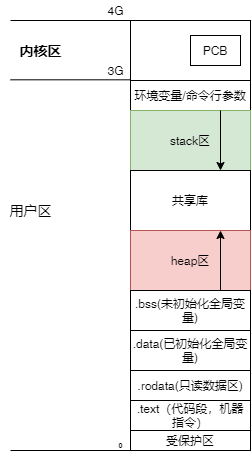

#### 指针，数组 typedef
猪肉炖粉条的大锅菜才好吃，指针又怎么能少的了数组与typedef

##### 一维数组
```c++
// 一维数组
void test_01()
{
    int data[3] = {0,1,2}; // data为 "int *" 类型
    int *ptr = data;
    cout << "data= " << data << " ptr= " << ptr << endl;
    cout << "sizeof(data)= " << sizeof(data) << " " << "sizeof(ptr)= " << sizeof(ptr) << endl;
    // 取值 pt 此时指向首地址
    cout << data[0] << " "  << *ptr << " "  << *data << endl;
    ptr = data;
    cout << *(ptr++) << endl;
    ptr = data;
    cout <<  *(ptr+1) << endl;


}
```
数组名不仅仅是指针，具体见参考文献1[^1][^2].
[^1]:[参考链接](https://blog.csdn.net/ljob2006/article/details/4872167)
[^2]:[参考链接](https://blog.csdn.net/weixin_30537451/article/details/98315609)


##### 二维数组

当二维数组遇到了指针，事情也就变的有趣了起来。
```C++
int zippo[4][2] = {1,2,3,4,5,6,7,8}; //  zippo为 "int (*)[2]" 类型指针
//int **temp = zippo; // error 类型不匹配

```
当`int **temp = zippo;`时，运行错误，原因为 zippo为 "int (*)[2]" 类型指针, 而temp 为二级指针，类型为指向 int 型指针的指针

关于`地址`
```c++
// 二维数组
void test_02()
{
    int zippo[4][2] = {1,2,3,4,5,6,7,8}; //  zippo为 "int (*)[2]" 类型指针
    //int **temp = zippo; // error 类型不匹配
    int (*pt_2)[2] = zippo;  // 一个指向数组(内含两个 int 类型的值) 的指针
    cout << "sizeof(zippo)= " << sizeof(zippo) << " sizeof(pt_2)= " << sizeof(pt_2) << endl;

    cout << "***addr start***" << endl;
    pt_2++;
    printf("%d\n",pt_2);
    printf("zippo   = %d\n",zippo);
    printf("zippo[0]= %d *zippo[0]= %d\n",zippo[0], *zippo[0]);
    printf("zippo[1]= %d *zippo[1]= %d\n",zippo[1], *zippo[1]);
    printf("zippo[2]= %d *zippo[2]= %d\n",zippo[2], *zippo[2]);
    printf("zippo[3]= %d *zippo[3]= %d\n",zippo[3], *zippo[3]);

    cout << "***addr end***" << endl;
    // 取值  [] 等价于 地址偏移后，用* 号解引用
    pt_2 = zippo;
    for(int i = 0 ; i < 4; i++){
        for(int j  = 0 ; j < 2 ; j++){
            cout << " " << *(zippo[i] + j)  << " " << *(pt_2[i] + j) << " " << ( *(*(pt_2 + i) +j) ) ;
        }
        cout << endl;
    }
    
}

```


##### [] * 
当$*[]$  ,相遇时，优先级如下：
```
数组名后面的[]和函数名后面的()具有相同的优先级，他们的优先级高于 * (解引用运算符)。
[]和() 优先级相同的时候，从左向右结合
```
分析
```c++
1.    int board[8][9]; // 声明一个 8*9 int 类型的数组
2.    int **ptr; // 声明一个 指向指针的指针，被指向的指针指向 int
3.    int *risk[10]; // 声明内含 10 个元素的数组，数组内每个元素都是指向 int 的指针 
4.    int (*risk)[10]; // 声明一个指向数组的指针，该数组内含10 个 int 的元素
5.    int *oof[3][4]; // 声明一个 3*4 的数组，数组内每个元素都是 指向 int 的指针
6.    int (*oof)[3][4]; // 声明 一个指向 3*4 的指针，该数组每个元素为 int 类型
7.    int (*oof[3])[4]; // 声明 一个内含 3 个指针元素的数组，其中每个指针都指向一个内含 4 个int 类型元素的数组

```
解释如下：
```c++
1. [][]从左向右结合。board[8],声明board是一个内含8个元素的数组，而后继续向右结合，board[8]的每个元素又内含 9 个元素
2. ptr与* 结合声明为指针，继续结合* ,声明为指向指针的指针。

3. 根据优先级规则 risk优先结合[],故是一个数组，*表示risk 数组内含10个数组
4. risk与* 结合声明为一个指针，而后结合[],声明指针指向的为一个内含10个int 类型元素的数组

5. off与[3]结合声明为一个off 为内含3个元素的数组，继续结合[4],off[3]的每个元素内含4个元素，继续结合* ，声明每个元素都为指针。
6. (*oof) 声明为一个指针，指向 3*4  的int 类型数组。
7. oof[3] 声明是一个内含3个元素的数组，*oof[3] 每个元素为 指针类型， (*oof[3])[4] 每个指针指向 一个内含 4 个int 类型元素的数组


```

##### 函数与指针
###### 1.函数与函数指针
```c++
char * func(char* ptr); // 函数声明
char* (*pt)(char* ptr); // pt 为函数指针,只是将函数名换成 (*pt)
char* func(char* ptr) //函数原型
{
    return NULL;
}

```

```c++

// 函数定义
int func_1(char *ptr)
{
    return 0;
}
int func_2(char * ptr)
{
    return 1;
}

// 函数调用
int fuc(int (*pt_1)(char *ptr), int (*pt_2)(char *ptr), int nums)
{
    int resu = (*pt_1)(NULL) + (*pt_2)(NULL) + nums;
    int resu_1 = pt_1(NULL) + pt_2(NULL);
    return resu_1;
}

int test_1()
{
    int (*pt_1)(char *ptr); //定义函数指针，将函数原型中函数名换成(*pt_1), pt_1 为函数指针，输出参数为 char型指针，输出参数为int 型
    int (*pt_2)(char *ptr);
    pt_1 = func_1;
    pt_2 = func_2;
    int resu = fuc(pt_1, pt_2, 3);
    cout << "resu= " << resu << endl;
    return 0;

}
```

###### 2.函数与数组指针
`一维数组`
```c++
    int data_1[3]={0,1,2};
    // 函数定义
    void test_03(int param[10])
    {
        for(int i = 0 ; i < 10; i++){
            cout <<param[i] << " ";
        }
        cout << endl;
    }
    void test_03( int *pt, int lenth)
    {
        for(int i = 0 ; i <lenth; i++ ){
            pt[i] = pt[i]+1;
        }

    }

    void test_03_01(int data[], int lenth)
    {
        for(int i = 0 ; i <lenth; i++ ){
            data[i] = data[i]+1;
        }
    }
    void m_print(const int *pt, int lenth) // 只读方式
    {
        for(int i = 0 ; i < lenth ; i++){
            cout << *(pt+i) << " ";
        }
        cout << endl;

    }
    // 函数调用
    test_03(data_1);
    test_03(data_1, sizeof(data_1)/sizeof(int));
```

`二维数组`

指针传递

```c++
// 普通传递
void test_04_01(int data[2][3])
{
    data[0][0] = 100;
    cout << endl;
}
// 传递数组。第二维必须确定
//方法1：传递数组，注意第二维必须标明
void fun1(int arr[][3],int iRows)
{
    for(int i=0;i<iRows;i++){
        for(int j=0;j<3;j++){
            cout<<arr[i][j]<<" ";
        }
        cout<<endl;
    }
    cout<<endl;
}
// 一重指针
void fun2(int (*arr)[3],int iRows)
{
  
 for(int i=0;i<iRows;i++)
 {
    for(int j=0;j<3;j++)
    {
         cout<<arr[i][j]<<" ";
    }
    cout<<endl;
 }
 cout<<endl;
}
// 指针传递,不管是几维数组都把他看成是指针，
void fun3(int*arr,int iRows,int iCols)
{
    for(int i=0;i<iRows;i++){
        for(int j=0;j<3;j++){
            cout<<*(arr+i*iCols+j)<<" ";
        }
        cout<<endl;
    }
    cout<<endl;
}
int main()
{
 int a[2][3]={{1,2,3},{4,5,6}};
 fun1(a,2);
 cout<<endl;
 fun2(a,2);
 cout<<endl;
 //此处必须进行强制类型转换，因为a是二维数组，而需要传入的是指针
 //所以必须强制转换成指针，如果a是一维数组则不必进行强制类型转换
 //为什么一维数组不用强制转换而二维数组必须转换，二维数组类型为 int (*p)[3];
 fun3((int*)a,2,3);
 cout<<endl;
}
```


##### typedef
习惯上把用 typedef 定义的类型名用大写字母表示，以区别C语言提供的标准类型标识符，如int char.
```c++
#include<stdio.h>
#include<stdlib.h>
#include<iostream>
#include<math.h>

using namespace std;

// typedef 判断时候，将typedf 暂时去掉
typedef unsigned char BYTE;

typedef int NUM[100]; // 定义NUM 为整型数组类型
NUM n; // 定义n 为整型数组变量，原先需要定义为： int n[100];

typedef char *PSTRING; // 定义 PSTRING 为字符指针类型
PSTRING p , q; // char * p; char *q;

typedef int (*POINTER)(); // 定义 POINTER为 指向函数的指针类型，函数返回值为整数型
POINTER p1,p2;

typedef void (*V_FP_CHARP)(char *);

// 函数数组指针混合
typedef char (* FRPTC()) [5]; // FRPTC声明为一个函数类型，该函数返回一个指针
// 该指针指向内含5 个char 类型元素的数组

typedef int (*testCases[10])(); // 定义了数组，testCases[10],数组中的元素是函数指针，函数指针的类型是 int (*)();

int (*pt1)(void);
pt1 = nullptr; // error
double (*pdf)(double);
pdf = sin;// error函数体外只能进行如变量或函数定义声明等，不能执行语句或调用函数！！！


int func_1()
{
    return 1;
}
int func_2(void)
{
    return 2;
}


void func(int (*pt1)(), int (*pt2)())
{
    p1 = nullptr;
    p1 = pt1;
    
    int resu = (*p1)(); // 
    resu = p1();
    resu += (*pt2)();
    cout << resu<< endl;
    cout << "hello" << endl;
}


int main()
{
    func(func_1, func_2);
  return 0;

}
```
参考[^M]:
[^M]:[参考链接](https://blog.csdn.net/keensword/article/details/400577)





