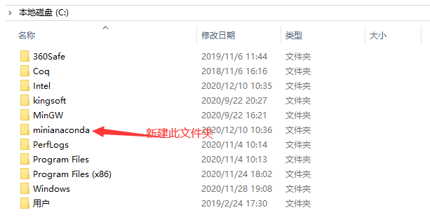
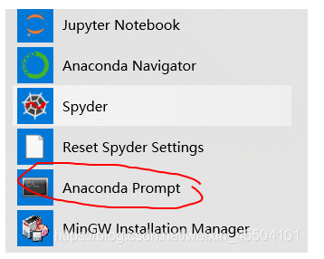
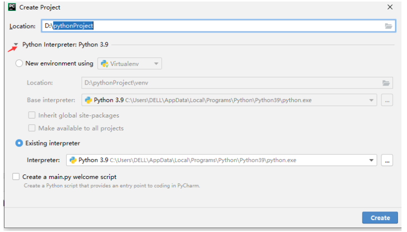
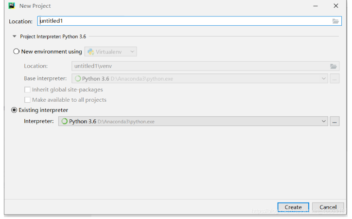
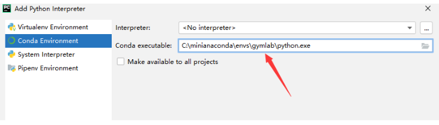
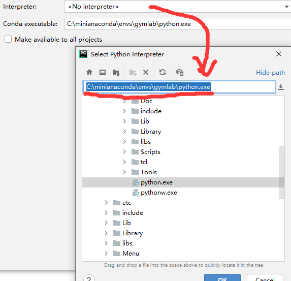

#### miniAncond + Pycharm联合使用
1. 安装miniconda
+ 本地新建文件夹 (建议C盘)



安装在此

+安装过程中，两个均打勾

+ 以管理员方式运行


+ 创建虚拟环境

```
conda create -n gymlab python=3.6
activate gymlab
pip install gym

创建一个 名为 gymlab 的环境，python 3.6 版本
启动 gymlab 环境
安装 gym 包


```
+ 配合pycharm 使用

A 创建新工程
B 





location是你这个工程的存放位置，你随意
然后选择Existing interpreter
点那个三个点点，选择conda environment

然后右边conda executable选择路径为你安装Anaconda的路径下/envs/tensorflow/python.exe



