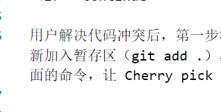

#### 脚注

使用 Markdown[^1]可以效率的书写文档, 直接转换成 HTML[^2], 你可以使用 Typora[^T] 编辑器进行书写。这是一个超链接[^8].脚注会自动编号。
参考文献：
[^1]:Markdown是一种纯文本标记语言
[^2]:HyperText Markup Language 超文本标记语言
[^T]:NEW WAY TO READ & WRITE MARKDOWN.
[^8]:这是一个链接 [markdown语法参考链接](https://www.imooc.com/wiki/markdownlesson/markdownblockquotes.html)

在需要添加注脚的文字后加上脚注名： [^注脚名] 。 然后在文本的任意位置(一般在最后)添加脚注：
```
脚注名:脚注内容
```
代码：
```
使用 Markdown[^1]可以效率的书写文档, 直接转换成 HTML[^2], 你可以使用 Typora[^T] 编辑器进行书写。
[^1]:Markdown是一种纯文本标记语言
[^2]:HyperText Markup Language 超文本标记语言
[^T]:NEW WAY TO READ & WRITE MARKDOWN.

```

#### 图片

插入图片相对路径



#### 公式

这是一个公式
$$  a^2 + b ^2 = 1  \tag{2-1}  $$


#### 参考文献使用等


markdown 参考文献：

香叶树[<sup>[1]</sup>](#refer-anchor-1)是一种很好的植物。


dddddddddddddddddddddddddddddddddddddddddddddddddddddddddddddddddddddddddddddddddddddddddddddddddddddddddddddddddddddddddddddddddd

##### 参考文献
<div id="refer-anchor-1"></div>
[1] 王世强著. 模型论基础[M]. 北京：科学出版社, 1987.
<div id="refer-anchor-2"></div>
[2]	和福生等编. 近世代数基础[M]. 昆明：云南科学技术出版社, 1996.

[3] [markdown语法参考链接](https://www.imooc.com/wiki/markdownlesson/markdownblockquotes.html)

##### 超链接
文件跳转
[test](指针.cpp)
[指针.cpp](指针.cpp)
[figute/1138.png](./figure/1138.png)


##### 画图
markdown画图[^图]
[^图]: [使用 Typora 画图（类图、流程图、时序图） - 知乎 (zhihu.com)](https://zhuanlan.zhihu.com/p/172635547)