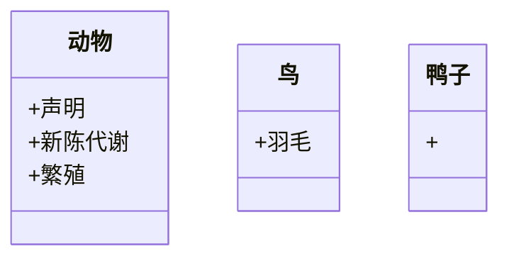
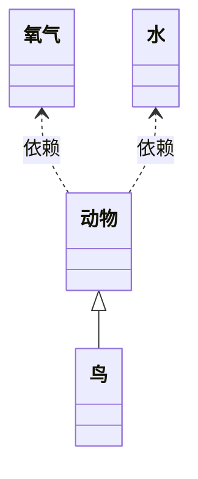
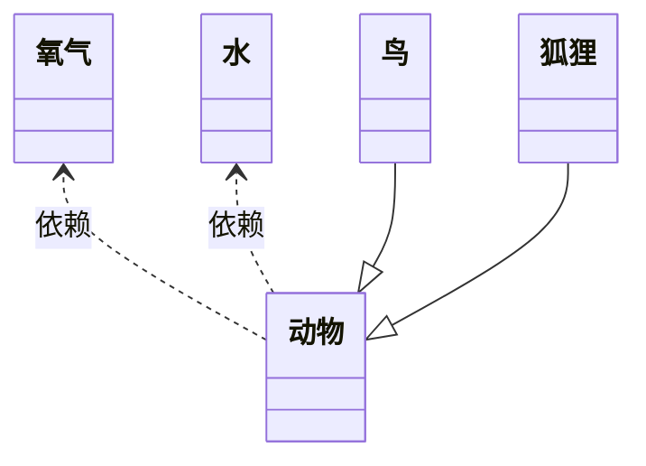

### UML统一建模语言
```
UML图：
    静态模型图：
        类图，对象图，包图，组件图，部署图
    动态模型图：
        用例图，时序图，协作图，状态图，活动图
```
```
用例图：
    泛化，扩展，包含关系

```

```
类图关系：
    泛化(继承)
    实现(抽象类)
    依赖：一个类为另外一个类的函数参数或者返回值
    关联：一个类为另外一个类的成员变量
        聚合：整体和部分可分
        组合：生命中整体与部分
```







