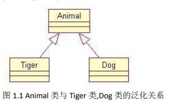
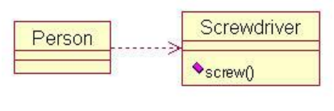

### UML图

#### 关联

`关联`:是一种拥有关系，具有方向性，如果一个类单方向访问另一个类，则称为`单向关联`(用一个箭头的实线表示)；如果两个类对象可以互相访问，则称为`双向关联`(用两个箭头或者不用箭头的实线表示)；一个对象能访问关联对象的数目叫做`多重性`。用带普通箭头的实现表示 —>，箭头指向被拥有者，或者不用箭头的实线表示—

s


#### 聚合

`聚合`是整体和部分之间的关系。当某个实体聚合成另一个实体时，该实体还可以是另外一个实体的部分。

用带空心菱形的实线表示,菱形指向整体，箭头指向个体。


#### 组合

`组合`：整体与部分之间的关系，组合比聚合更加严格，当某个实体组合成另一个实体时，两者具有相同的生命周期，例如：手臂和人之间存在的是组合关系。

用带实心菱形的实线表示。菱形指向整体，箭头指向个体。


#### 泛化

`泛化`：表示一个更泛化的元素和一个更具体的元素之间的关系，与`继承`是同一个概念。

用带三角箭头的实线表示，箭头指向父类。

```mermaid

```


#### 实现

`实现`:类与接口的关系，类实现接口。

用带 三角箭头的虚线表示  ，箭头指向父接口

```
接口(包括抽象类)是方法的集合，在实现关系中，类实现了接口，类中的方法实现了接口声明的所有方法。

```


#### 依赖

`依赖`：如果一个类的改动会影响到另外一个类，则两个类之间存在依赖关系，一般而言，依赖是单向的。

用带普通箭头的虚线表示 ，箭头指向被依赖者。


### 设计模式
#### 类与类之间的关系
##### 泛化
继承




##### 依赖




##### 关联
+ 聚合

+ 组合


#### 创建型模式
```

```

+ 工厂模式
+ 抽象工厂模式
+ 单例模式
+ 建造者模式
+ 原型模式


#### 结构型模式

```

```

+ 适配器模式
+ 桥接模式
+ 过滤器模式
+ 组合模式
+ 装饰器模式
+ 外观模式
+ 享元模式
+ 代理模式


#### 行为型模式

```

```

##### 责任链模式
##### 解释器模式
##### 迭代模式
##### 中介模式


##### 备忘录模式
##### 观察者模式
##### 策略模式
##### 模板模式
##### 访问者模式


